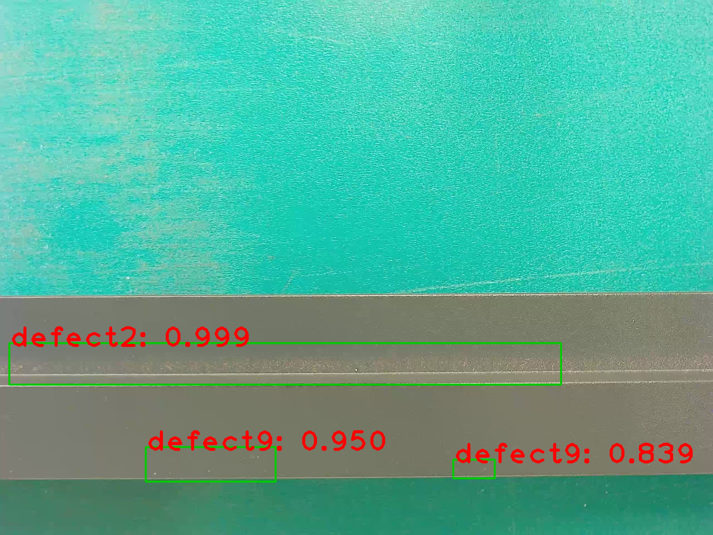
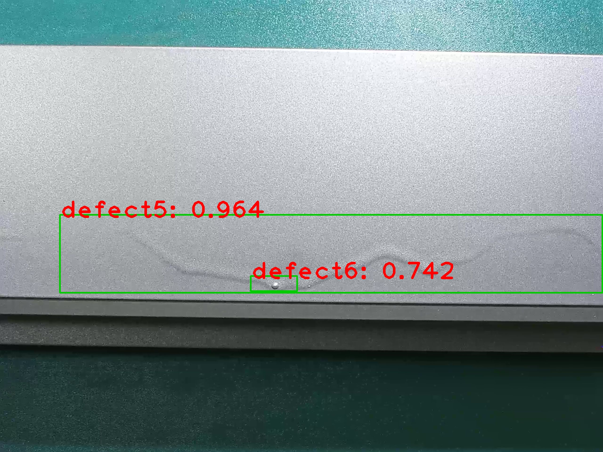
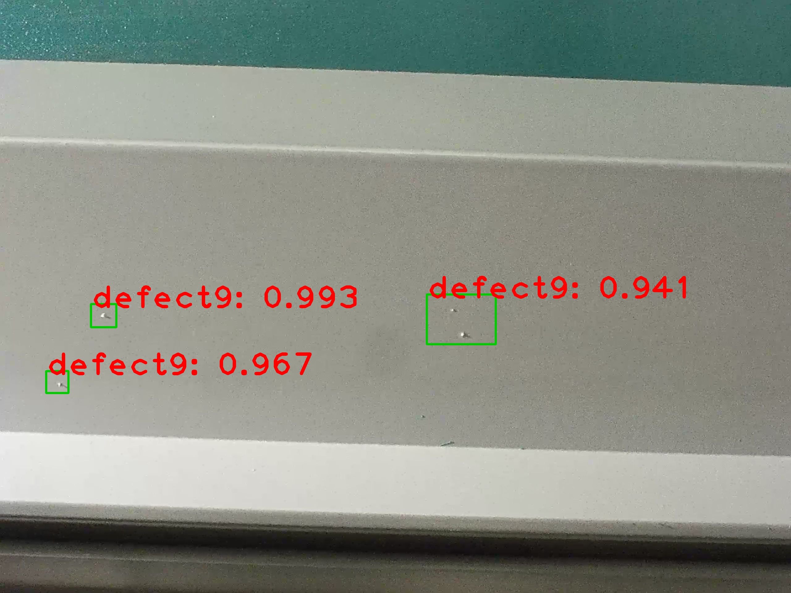
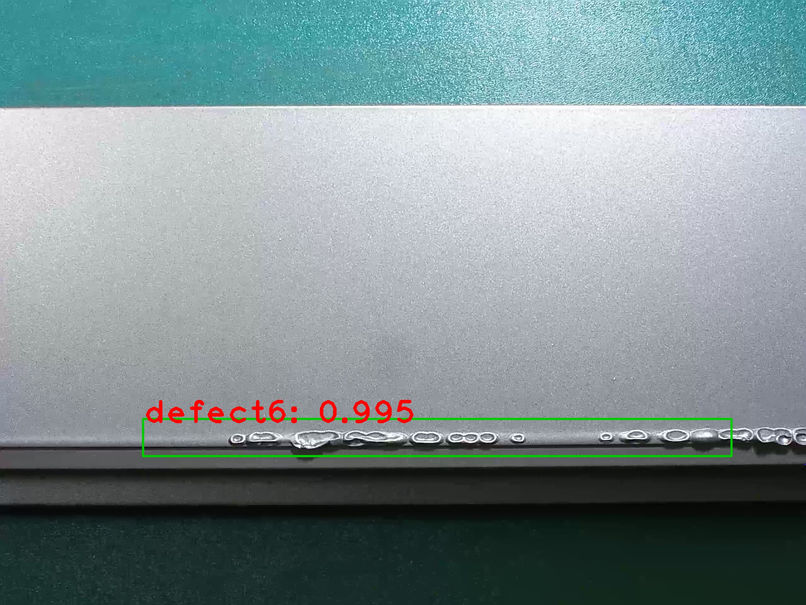

# TianChi 2018广东工业智造大数据创新大赛——智能算法赛（复赛baseline代码）

## Introduction

baseline采用faster-rcnn（pytorch）算法，由[jwyang](https://github.com/jwyang)提供，在修复几个小毛病之后，代码跑起来没什么毛病，在此表示感谢。比赛代码[链接](https://tianchi.aliyun.com/competition/introduction.htm?spm=5176.11409106.5678.1.79c16bee10uj5K&raceId=231682)

## Preparation

First of all, clone the code
```
git clone https://github.com/Vipermdl/Faster-Rcnn_Tianchi_Guangdong.pytorch
```

Then, create a folder:
```
cd Faster-Rcnn_Tianchi_Guangdong.pytorch && mkdir data
```

### prerequisites

* Python 2.7 or 3.6
* Pytorch 0.4.0 (**now it does not support 0.4.1 or higher**)
* CUDA 8.0 or higher

### Data Preparation

* **PASCAL_VOC 07+12**: Please follow the instructions in [py-faster-rcnn](https://github.com/rbgirshick/py-faster-rcnn#beyond-the-demo-installation-for-training-and-testing-models) to prepare VOC datasets. Actually, you can refer to any others. After downloading the data, creat softlinks in the folder data/.


### Pretrained Model

We used two pretrained models in our experiments, VGG and ResNet101. You can download these two models from:

* VGG16: [Dropbox](https://www.dropbox.com/s/s3brpk0bdq60nyb/vgg16_caffe.pth?dl=0), [VT Server](https://filebox.ece.vt.edu/~jw2yang/faster-rcnn/pretrained-base-models/vgg16_caffe.pth)

* ResNet101: [Dropbox](https://www.dropbox.com/s/iev3tkbz5wyyuz9/resnet101_caffe.pth?dl=0), [VT Server](https://filebox.ece.vt.edu/~jw2yang/faster-rcnn/pretrained-base-models/resnet101_caffe.pth)

Download them and put them into the data/pretrained_model/.

**NOTE**. We compare the pretrained models from Pytorch and Caffe, and surprisingly find Caffe pretrained models have slightly better performance than Pytorch pretrained. We would suggest to use Caffe pretrained models from the above link to reproduce our results.

**If you want to use pytorch pre-trained models, please remember to transpose images from BGR to RGB, and also use the same data transformer (minus mean and normalize) as used in pretrained model.**

### Compilation


Install all the python dependencies using pip:
```
pip install -r requirements.txt
```

Compile the cuda dependencies using following simple commands:

```
cd lib
sh make.sh
```

It will compile all the modules you need, including NMS, ROI_Pooing, ROI_Align and ROI_Crop. The default version is compiled with Python 2.7, please compile by yourself if you are using a different python version.

**As pointed out in this [issue](https://github.com/jwyang/faster-rcnn.pytorch/issues/16), if you encounter some error during the compilation, you might miss to export the CUDA paths to your environment.**

## Train

Before training, set the right directory to save and load the trained models. Change the arguments "save_dir" and "load_dir" in trainval_net.py and test_net.py to adapt to your environment.

To train a faster R-CNN model with vgg16 on pascal_voc, simply run:
```
CUDA_VISIBLE_DEVICES=$GPU_ID python trainval_net.py \
                   --dataset pascal_voc --net vgg16 \
                   --bs $BATCH_SIZE --nw $WORKER_NUMBER \
                   --lr $LEARNING_RATE --lr_decay_step $DECAY_STEP \
                   --cuda
```
where 'bs' is the batch size with default 1. Alternatively, to train with resnet101 on pascal_voc, simple run:
```
 CUDA_VISIBLE_DEVICES=$GPU_ID python trainval_net.py \
                    --dataset pascal_voc --net res101 \
                    --bs $BATCH_SIZE --nw $WORKER_NUMBER \
                    --lr $LEARNING_RATE --lr_decay_step $DECAY_STEP \
                    --cuda
```
Above, BATCH_SIZE and WORKER_NUMBER can be set adaptively according to your GPU memory size. **On Titan Xp with 12G memory, it can be up to 4**.

If you have multiple (say 8) Titan Xp GPUs, then just use them all! Try:
```
python trainval_net.py --dataset pascal_voc --net vgg16 \
                       --bs 24 --nw 8 \
                       --lr $LEARNING_RATE --lr_decay_step $DECAY_STEP \
                       --cuda --mGPUs

```

Change dataset to "coco" or 'vg' if you want to train on COCO or Visual Genome.

## Test

If you want to evlauate the detection performance of a pre-trained vgg16 model on pascal_voc test set, simply run
```
python test_net.py --dataset pascal_voc --net vgg16 \
                   --checksession $SESSION --checkepoch $EPOCH --checkpoint $CHECKPOINT \
                   --cuda
```
Specify the specific model session, chechepoch and checkpoint, e.g., SESSION=1, EPOCH=6, CHECKPOINT=416.

## Demo

If you want to run detection on your own images with a pre-trained model, download the pretrained model listed in above tables or train your own models at first, then add images to folder $ROOT/images, and then run
```
python demo.py --net vgg16 \
               --checksession $SESSION --checkepoch $EPOCH --checkpoint $CHECKPOINT \
               --cuda --load_dir path/to/model/directoy
```

Then you will find the detection results in folder $ROOT/images.

**Note the default demo.py merely support pascal_voc categories. You need to change the [line](https://github.com/jwyang/faster-rcnn.pytorch/blob/530f3fdccaa60d05fa068bc2148695211586bd88/demo.py#L156) to adapt your own model.**

Below are some detection results:

<div style="color:#0000FF" align="center">
 
</div>

